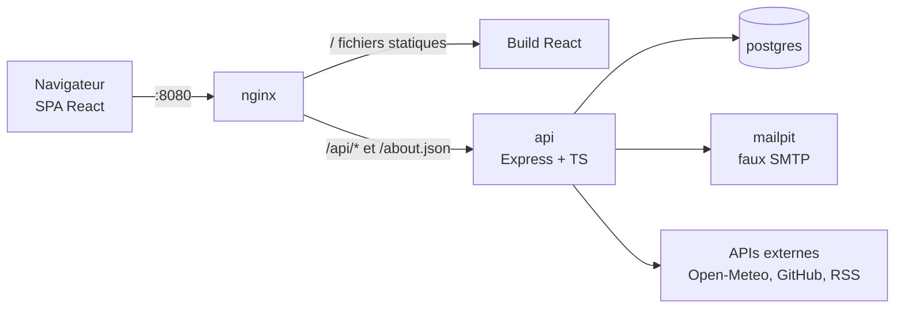
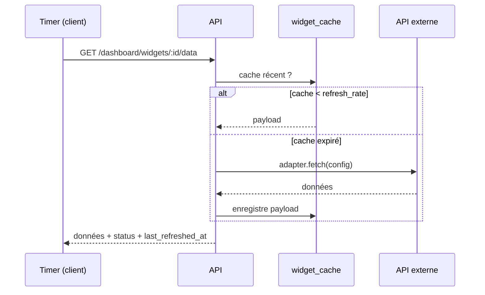

# Dashboard EPITECH – Plan corrigé

> Mis à jour le 23/09/2026 · Binôme (X = 2) · Livraison le 01/10/2026

## Sommaire

1. [Résumé](#1-résumé)
2. [Exigences du sujet](#2-exigences-du-sujet-rappel)
3. [Périmètre](#3-périmètre)
4. [Architecture](#4-architecture)
5. [Services et widgets](#5-services-et-widgets)
6. [API REST](#6-api-rest)
7. [Endpoint /about.json](#7-endpoint-aboutjson)
8. [Répartition des tâches](#8-répartition-des-tâches)
9. [Planning 23/09 → 01/10](#9-planning-2309--0110)
10. [Pièges techniques](#10-pièges-techniques)
11. [Sécurité](#11-sécurité)
12. [Organisation Git et travail](#12-organisation-git-et-travail)
13. [Choix technologiques et soutenance](#13-choix-technologiques-et-soutenance)
14. [Checklist avant livraison](#14-checklist-avant-livraison)

---

## 1. Résumé

Il reste 8 jours avant la livraison du 01/10 et le backend n'existe pas encore : on réduit le périmètre et on rééquilibre la charge. Le front (prototype React mock) est avancé. Il manque le backend, Docker, `/about.json`, la vraie auth, OAuth et le README racine.

Décisions clés :

- **Objectif = 3 services, 6 widgets.** Pas 9 : la formule du sujet est (1 + X) services et (3 × X) widgets, avec X = 2.
- **Priorité n°1 : `docker-compose up` + `/about.json` sur :8080 dès le 24/09.** C'est le premier test du correcteur.
- **Architecture simplifiée :** Timer côté client + cache serveur. Pas de worker BullMQ ni de Redis avant le 01/10.
- **Registre de widgets unique** côté back : il génère `/about.json`, la validation des configs et les formulaires du front.
- **Coupé :** OIDC Google, Steam, CI complète, Storybook. Reportés en bonus si le temps le permet.
- **Rééquilibrage :** B prend Docker, nginx et `/about.json` en entier, car le front du dashboard existe déjà dans le prototype.

---

## 2. Exigences du sujet (rappel)

Pour un groupe de 2, le sujet exige au minimum 3 services et 6 widgets, chacun avec au moins un paramètre configurable. Un widget sans paramètre n'est pas compté.

| Exigence | Détail | État au 23/09 |
| --- | --- | --- |
| Services | ≥ 3 (1 + X) | 3 en UI (weather, github, rss) |
| Widgets | ≥ 6 (3 × X), chacun avec ≥ 1 paramètre | 6 en UI, données mock |
| Inscription + confirmation | Formulaire, confirmation avant accès | UI seule |
| Authentification | Identifiants ou OIDC | localStorage |
| Autorisation | OAuth 2.0, compte tiers lié à l'utilisateur | Factice |
| Abonnement aux services | Services sans compte disponibles par défaut, les autres après abonnement | UI mock |
| Dashboard | Ajouter, reconfigurer, déplacer, supprimer | UI mock |
| Instances multiples | Deux instances du même widget, configs différentes, données distinctes | OK en mock |
| Timer | Chaque instance communique son refresh rate au Timer | Client uniquement |
| Administration | Gestion des utilisateurs | UI mock |
| Docker | `docker-compose build` puis `up`, fichier à la racine | Absent |
| `/about.json` | GET sur http://localhost:8080/about.json | Absent |
| README.md racine | Features, install, usage, stack, structure | Absent |
| Dossier `bonus/` | Tout ce qui est hors sujet (Makefile, scripts…) | Absent |
| UX | Interface responsive, accessible | Bien avancé |

Dans `/about.json`, les seuls types de paramètres autorisés sont `integer` et `string`. `client.host` doit être l'IP réelle du client, et `current_time` un timestamp Unix en secondes.

---

## 3. Périmètre

On livre au 01/10 uniquement ce que le sujet exige. Le reste passe après la livraison, dans le dossier `bonus/` ou dans des branches séparées.

| Élément | Décision | Raison |
| --- | --- | --- |
| Auth email + mot de passe + confirmation | Garder | Exigé |
| OAuth 2.0 GitHub lié au compte | Garder | Exigé (autorisation des widgets) |
| 6 widgets branchés sur de vraies APIs | Garder | Exigé |
| Dashboard CRUD persisté + Timer | Garder | Exigé |
| Admin : liste, suspension, suppression d'utilisateurs | Garder | Demandé par le sujet |
| Admin stats | Garder si le temps le permet | Simple : quelques `COUNT` |
| Rate limiting, Zod, bcrypt, tokens chiffrés | Garder | Sécurité exigée |
| Thème clair/sombre, responsive | Garder | Déjà fait dans le prototype |
| OIDC Google | Reporter | Le sujet accepte l'inscription par email seule |
| OAuth Steam | Supprimer | Hors de nos services ; Steam utilise OpenID 2.0 |
| Worker BullMQ + Redis | Reporter | Trop coûteux à 8 jours ; le Timer client suffit |
| CI GitHub Actions complète | Réduire | Lint + build seulement |
| Playwright multi-navigateurs | Réduire | 1 scénario E2E sur Chromium |
| Storybook, widgets Spotify/WhatsApp | Reporter | Bonus |

---

## 4. Architecture

On garde un monolithe modulaire derrière nginx, avec 4 conteneurs : nginx, api, postgres, mailpit.



nginx est le seul conteneur exposé, sur le port 8080. Il sert le front et relaie `/api/*` et `/about.json` vers l'API. Front et API partagent la même origine, ce qui évite les problèmes de CORS.

### 4.1 Conteneurs

| Service | Image / build | Rôle | Port |
| --- | --- | --- | --- |
| nginx | build multi-étapes `./frontend` (Vite build puis nginx:alpine) | Sert le SPA, reverse proxy | 8080 exposé |
| api | build `./backend` | Express, migrations Drizzle au démarrage, `/about.json` | 3000 interne |
| postgres | postgres:16 | Données, volume nommé | 5432 interne |
| mailpit | axllent/mailpit | Reçoit les mails de confirmation | UI 8025 (démo) |

### 4.2 Registre de widgets : une seule source de vérité

Chaque widget est déclaré une seule fois côté back, dans `backend/src/widgets/registry.ts`. Une entrée contient :

- `service`, `name`, `description` ;
- `params` : liste `{ name, type: 'string' | 'integer', label, default }` ;
- `schema` : schéma Zod de la configuration ;
- `fetch(config, ctx)` : l'adapter qui appelle l'API externe et renvoie des données normalisées.

```ts
// Exemple de forme (à adapter)
export interface WidgetDefinition<C> {
  service: 'weather' | 'github' | 'rss';
  name: string;
  description: string;
  params: { name: keyof C & string; type: 'string' | 'integer'; label: string; default?: unknown }[];
  schema: z.ZodType<C>;
  fetch(config: C, ctx: { userId: string }): Promise<unknown>;
}
```

À partir de ce registre :

- on génère `/about.json` ;
- on valide les configs à la création et à la reconfiguration d'une instance ;
- on sert `GET /api/v1/widgets` au front, et la modale de configuration construit ses champs depuis cette réponse.

Plus besoin de `catalog.ts` codé en dur ni de colonne `params_schema` en base. C'est notre pattern Strategy/Adapter, sans duplication.

### 4.3 Timer

Le Timer est centralisé côté client, et le cache est côté serveur.

1. Au chargement du dashboard, chaque instance s'enregistre auprès du Timer client avec son `refresh_rate` (minimum 30 s).
2. À chaque échéance, le Timer appelle `GET /api/v1/dashboard/widgets/:id/data`.
3. L'API renvoie le cache s'il a moins de `refresh_rate` secondes. Sinon, elle appelle l'adapter, stocke le résultat dans `widget_cache` et le renvoie.
4. L'API met à jour `last_refreshed_at` et `status` (`ok` / `error`). Le front affiche ces deux informations.

Ce design respecte le sujet : chaque instance communique son refresh rate au Timer, qui déclenche les mises à jour. Il évite aussi d'appeler les APIs externes pour des dashboards que personne ne regarde. Un worker serveur (BullMQ) reste une évolution possible après la livraison.



### 4.4 Modèle de données (8 tables)

| Table | Champs clés | Responsable |
| --- | --- | --- |
| users | id, email, password_hash, role (`user`/`admin`), email_confirmed, suspended, created_at | A |
| email_tokens | id, user_id, token_hash, expires_at | A |
| refresh_tokens | id, user_id, token_hash, expires_at, revoked | A |
| oauth_accounts | id, user_id, provider, provider_user_id, access_token (AES-256-GCM), scope | A |
| user_services | user_id, service_name, subscribed_at | A |
| widget_instances | id, user_id, widget_name, config (jsonb), position, refresh_rate, last_refreshed_at, status | B |
| widget_cache | widget_instance_id, payload (jsonb), fetched_at | B |
| audit_logs | id, user_id, action, payload, created_at | B |

Les tables `services` et `widgets` disparaissent : le registre en code les remplace. Pour la position, un simple entier d'ordre suffit si la grille est une liste triable. Gardez x/y seulement si le front en a déjà besoin.

### 4.5 Structure du dépôt

```
dashboard/
├── docker-compose.yml
├── .env.example
├── README.md
├── PLAN.md
├── nginx/nginx.conf
├── frontend/            # React + Vite + TS (Dockerfile multi-étapes)
├── backend/
│   ├── src/
│   │   ├── modules/     # auth, services, dashboard, admin, about
│   │   ├── widgets/     # registry.ts + un fichier par adapter
│   │   ├── db/          # schéma Drizzle, migrations, seed admin
│   │   ├── lib/         # crypto.ts, mailer.ts
│   │   ├── middleware/  # auth, validate(zod), errors, rateLimit
│   │   └── app.ts
│   ├── API.md           # contrats d'API
│   └── Dockerfile
└── bonus/
```

Chaque module suit la séparation Controller → Service → Repository.

---

## 5. Services et widgets

On garde les 6 widgets du prototype, avec deux ajustements : Open-Meteo à la place d'OpenWeatherMap, et un `feed_summary` vraiment multi-flux.

| Service | Widget | Paramètres | Source de données | Resp. |
| --- | --- | --- | --- | --- |
| weather (par défaut) | city_temperature | city (string), unit (string : C/F) | Open-Meteo géocodage + forecast | A |
| weather (par défaut) | precipitation_forecast | city (string), days (integer, 1–7) | Open-Meteo, précipitations journalières | B |
| github (OAuth) | recent_commits | repository (string, owner/repo), limit (integer, 1–20) | API REST GitHub, commits | A |
| github (OAuth) | security_alerts | repository (string), severity (string) | API GitHub, alertes Dependabot | B |
| rss (par défaut) | article_list | link (string, URL), number (integer, 1–20) | Parsing XML (rss-parser) | A |
| rss (par défaut) | feed_summary | links (string, URLs séparées par des virgules), number (integer) | Plusieurs flux fusionnés, triés par date | B |

- **Pourquoi Open-Meteo :** gratuit, sans clé API, avec prévisions journalières de précipitations. On évite de gérer un secret de plus.
- **Risque `security_alerts` :** l'API des alertes Dependabot demande des droits sur le dépôt et que Dependabot y soit activé. À tester le 24/09 sur un dépôt à nous. Si ça échoue, on le remplace par `open_issues` (repository, state).
- **`feed_summary` vs `article_list` :** le premier fusionne plusieurs flux et indique la source de chaque article, le second liste un seul flux. Sans cette différence, le jury pourrait le compter comme un doublon.
- **Services par défaut :** weather et rss sont disponibles sans abonnement. github n'est disponible qu'après liaison OAuth.

---

## 6. API REST

Toutes les routes métier sont préfixées par `/api/v1`. Les entrées (body, query, params) sont validées par Zod ; une entrée invalide renvoie 400.

### 6.1 Authentification — Membre A

| Méthode | Route | Rôle |
| --- | --- | --- |
| POST | `/auth/register` | Inscription, envoie le mail de confirmation |
| POST | `/auth/confirm` | Confirme l'email avec le token reçu |
| POST | `/auth/login` | Connexion (refusée si email non confirmé ou compte suspendu) |
| POST | `/auth/refresh` | Nouveau access token via le refresh cookie |
| POST | `/auth/logout` | Révoque le refresh token |
| GET | `/auth/me` | Utilisateur courant |
| GET | `/auth/oauth/github` | Redirection vers GitHub (state signé) |
| GET | `/auth/oauth/github/callback` | Callback, lie le compte GitHub à l'utilisateur |
| DELETE | `/auth/oauth/github` | Délie le compte GitHub |

### 6.2 Services — Membre A

| Méthode | Route | Rôle |
| --- | --- | --- |
| GET | `/services` | Liste des services avec l'état d'abonnement de l'utilisateur |
| POST | `/services/:name/subscribe` | Abonnement (github : exige un compte lié) |
| DELETE | `/services/:name/subscribe` | Désabonnement |

### 6.3 Widgets et dashboard — Membre B

| Méthode | Route | Rôle |
| --- | --- | --- |
| GET | `/widgets` | Catalogue issu du registre (params, types, descriptions) |
| GET | `/dashboard` | Instances de l'utilisateur, triées par position |
| POST | `/dashboard/widgets` | Ajoute une instance (widget, config, refresh_rate) |
| PATCH | `/dashboard/widgets/:id` | Reconfigure (config, refresh_rate) |
| PATCH | `/dashboard/widgets/:id/position` | Déplace |
| DELETE | `/dashboard/widgets/:id` | Supprime |
| GET | `/dashboard/widgets/:id/data` | Données (cache ou appel de l'adapter) |

### 6.4 Admin (rôle `admin` requis)

| Méthode | Route | Rôle | Resp. |
| --- | --- | --- | --- |
| GET | `/admin/users` | Liste des utilisateurs | A |
| PATCH | `/admin/users/:id` | Suspendre / réactiver, changer le rôle | A |
| DELETE | `/admin/users/:id` | Supprimer | A |
| GET | `/admin/stats` | Nombre d'utilisateurs, widgets actifs, services les plus utilisés | B |

### 6.5 Endpoint obligatoire

| Méthode | Route | Rôle | Resp. |
| --- | --- | --- | --- |
| GET | `/about.json` (sans préfixe) | Description des services et widgets | B (A déclare ses widgets) |

---

## 7. Endpoint /about.json

Le serveur répond sur http://localhost:8080/about.json. La réponse est générée à partir du registre ; elle n'est jamais écrite à la main.

```json
{
  "client": { "host": "10.101.53.35" },
  "server": {
    "current_time": 1531680780,
    "services": [
      {
        "name": "weather",
        "widgets": [
          {
            "name": "city_temperature",
            "description": "Display the current temperature for a city",
            "params": [
              { "name": "city", "type": "string" },
              { "name": "unit", "type": "string" }
            ]
          },
          {
            "name": "precipitation_forecast",
            "description": "Display the precipitation forecast for the next days",
            "params": [
              { "name": "city", "type": "string" },
              { "name": "days", "type": "integer" }
            ]
          }
        ]
      },
      {
        "name": "github",
        "widgets": [
          {
            "name": "recent_commits",
            "description": "Display the recent commits of a repository",
            "params": [
              { "name": "repository", "type": "string" },
              { "name": "limit", "type": "integer" }
            ]
          },
          {
            "name": "security_alerts",
            "description": "Display the security alerts of a repository",
            "params": [
              { "name": "repository", "type": "string" },
              { "name": "severity", "type": "string" }
            ]
          }
        ]
      },
      {
        "name": "rss",
        "widgets": [
          {
            "name": "article_list",
            "description": "Display the last articles of a feed",
            "params": [
              { "name": "link", "type": "string" },
              { "name": "number", "type": "integer" }
            ]
          },
          {
            "name": "feed_summary",
            "description": "Display the latest articles merged from several feeds",
            "params": [
              { "name": "links", "type": "string" },
              { "name": "number", "type": "integer" }
            ]
          }
        ]
      }
    ]
  }
}
```

- `client.host` : `req.ip` avec `app.set('trust proxy', 1)` (voir §10).
- `current_time` : `Math.floor(Date.now() / 1000)`.
- Types autorisés : uniquement `integer` et `string`.

---

## 8. Répartition des tâches

Chacun garde ses 3 widgets de bout en bout (1 par service), mais B reprend l'infrastructure, car le front du dashboard existe déjà dans le prototype.

| Domaine | Membre A | Membre B |
| --- | --- | --- |
| Widgets (adapter back + branchement front) | city_temperature, recent_commits, article_list | precipitation_forecast, security_alerts, feed_summary |
| Auth | Register, login, JWT + refresh cookie, confirmation email, rate limit auth | — |
| OAuth GitHub | Flux complet : bouton, state signé, callback, liaison au compte, token chiffré | Utilise le token pour security_alerts |
| Services | `GET /services`, subscribe / unsubscribe, page « Mes services » branchée | — |
| Admin | Users : liste, suspension, suppression + seed admin | Stats globales |
| Dashboard | — | CRUD instances, positions, endpoint `/data` + cache, branchement grille et modale |
| Registre + `/about.json` | Déclare ses 3 widgets | Structure du registre + `/about.json` complet |
| Infra | — | `docker-compose.yml`, Dockerfiles, nginx.conf, mailpit, migrations au démarrage |
| Sécurité | bcrypt, politique de mot de passe, Zod sur l'auth | Module de chiffrement AES-256-GCM, Zod sur le dashboard, Helmet, audit logs |
| Documentation | README : partie utilisateurs | README : install, Docker, architecture |

**Règle de frontière :** le module de chiffrement (`crypto.ts`) est écrit par B le 24/09, et A l'utilise dans le callback OAuth. L'ancienne branche `b-oauth-github-ui` est supprimée : tout le flux OAuth est chez A.

**Front déjà fait :** chacun branche sur l'API réelle les écrans de son domaine. On remplace `api/demo.ts` et le localStorage par des appels à `/api/v1`.

**Relecture croisée :** chaque PR est relue par l'autre membre, qui doit comprendre le code back et front de son binôme pour pouvoir le présenter en soutenance.

---

## 9. Planning 23/09 → 01/10

Le premier jalon non négociable est le 24/09 au soir : `docker-compose up` sert le front et `/about.json` sur :8080.

| Jour | Membre A | Membre B | Jalon du soir |
| --- | --- | --- | --- |
| Mer 23/09 | Squelette `backend/` : Express + TS, Drizzle, table `users`, middleware d'erreurs | `docker-compose.yml`, Dockerfile front multi-étapes, nginx.conf, postgres, mailpit | Les conteneurs démarrent |
| Jeu 24/09 | Register + login (bcrypt, JWT, refresh cookie) | Registre de widgets + `/about.json` complet, `crypto.ts`, test de l'API Dependabot | `/about.json` conforme sur :8080 |
| Ven 25/09 | Confirmation email via Mailpit + branchement front auth | CRUD `widget_instances` + positions + branchement dashboard | Parcours inscription → login réel |
| Sam 26/09 | `user_services` + subscribe ; adapter `city_temperature` | Endpoint `/data` + cache ; adapter `precipitation_forecast` | Premier widget réel sur le dashboard |
| Dim 27/09 | OAuth GitHub complet (state, callback, liaison, token chiffré) | Adapters `feed_summary` + `security_alerts` (ou `open_issues`) | GitHub lié à un compte |
| Lun 28/09 | Adapters `recent_commits` + `article_list` | Admin stats + audit logs + Helmet | 6 widgets réels |
| Mar 29/09 | Admin users API + seed admin + rate limiting + Zod partout | 1 scénario E2E Playwright + corrections | Tout est branché, plus de mock |
| Mer 30/09 | README : partie utilisateurs + captures | README : install, architecture ; test sur machine propre | Clone → build → up validé |
| Jeu 01/10 | Vidéo de démo + gel | Vidéo de démo + gel | Livraison |

Du 02/10 au 11/10 : répétitions de la soutenance, corrections mineures, puis bonus éventuels (OIDC Google, worker BullMQ, Storybook) dans des branches séparées.

**Si on prend du retard :** on coupe d'abord admin stats, puis l'E2E, puis `security_alerts` (remplacé par `open_issues`). On ne coupe jamais Docker, `/about.json`, l'auth, OAuth GitHub ni les 6 widgets.

---

## 10. Pièges techniques

Ces pièges ne se voient qu'en fin d'intégration ; on les traite dès le départ.

**1. `/about.json` avalé par le SPA.** Sans règle nginx dédiée, `try_files` renvoie `index.html`. Il faut une location exacte, avant la règle générale :

```nginx
location = /about.json { proxy_pass http://api:3000; proxy_set_header X-Forwarded-For $proxy_add_x_forwarded_for; }
location /api/        { proxy_pass http://api:3000; proxy_set_header X-Forwarded-For $proxy_add_x_forwarded_for; }
location /            { root /usr/share/nginx/html; try_files $uri /index.html; }
```

**2. `client.host` = IP de nginx.** Derrière le proxy, `req.ip` renvoie l'IP interne Docker. Il faut `app.set('trust proxy', 1)` dans Express. Autre détail : `current_time` est en secondes, pas en millisecondes.

**3. Cookie `SameSite=Strict` et OAuth.** Au retour de github.com, le navigateur n'envoie pas un cookie Strict, et le callback ne sait plus qui est connecté. On utilise `SameSite=Lax` pour le cookie de session.

**4. Lier GitHub au bon utilisateur.** Le paramètre `state` est aléatoire, stocké côté serveur avec le `user_id` et une expiration courte. Le callback vérifie le `state` avant d'enregistrer le compte.

**5. URL de callback OAuth.** On déclare `http://localhost:8080/api/v1/auth/oauth/github/callback` dans l'OAuth App GitHub. Chaque membre crée sa propre OAuth App pour le dev, et les secrets restent dans `.env`, jamais commité.

**6. Migrations au démarrage.** L'API lance les migrations Drizzle puis le seed admin avant d'écouter. Postgres doit avoir un `healthcheck`, et l'API un `depends_on` avec `condition: service_healthy`.

**7. Mails de confirmation.** En Docker, le SMTP pointe vers `mailpit:1025`. Le lien de confirmation doit utiliser `http://localhost:8080`, pas l'hôte interne.

**8. Rate limit GitHub.** Sans token, la limite est de 60 requêtes/heure. Les appels GitHub passent toujours par le token de l'utilisateur, et le cache évite les appels inutiles.

---

## 11. Sécurité

- Mots de passe hachés avec bcrypt ; politique : 12 caractères minimum.
- Access token JWT court (15 min) + refresh token en cookie `HttpOnly`, `SameSite=Lax`, stocké haché en base et révocable.
- Rôles `user` / `admin`, vérifiés par un middleware sur chaque route sensible.
- Validation Zod sur toutes les entrées (body, query, params).
- Rate limiting en mémoire (`express-rate-limit`) : 100 req/min par IP, 10 req/min sur l'auth.
- Helmet pour les en-têtes HTTP. Front et API sur la même origine, donc pas de CORS ouvert.
- Tokens OAuth chiffrés au repos (AES-256-GCM, clé dans `.env`), jamais renvoyés au front.
- Audit logs sur les actions sensibles : login, liaison OAuth, suppression de widget, actions admin.
- Secrets uniquement dans `.env` (ignoré par git) ; `.env.example` commité avec des valeurs vides.
- Les URLs de flux RSS fournies par l'utilisateur sont validées (http/https uniquement) avant d'être appelées.

---

## 12. Organisation Git et travail

On passe de 20 branches à 8, pour limiter les merges pendant ces 8 jours.

| Membre | Branches |
| --- | --- |
| A | `feature/a-auth` (register, login, confirm), `feature/a-oauth-services` (OAuth GitHub + abonnements), `feature/a-widgets` (ses 3 adapters + branchement), `feature/a-admin-users` |
| B | `feature/b-infra` (Docker, nginx, registre, about.json), `feature/b-dashboard` (CRUD, /data, cache), `feature/b-widgets` (ses 3 adapters), `feature/b-admin-stats` |

- **Merge dans `develop` au moins une fois par jour**, avec relecture croisée rapide : 15 min max par PR.
- **`develop` doit toujours passer `docker-compose build && docker-compose up`.**
- **`main` et `develop` sont protégées** : pas de push direct.
- **Stand-up de 10 min chaque matin :** ce qui est mergé, ce qui bloque, le jalon du soir.
- **Contrats d'API d'abord :** avant de coder un endpoint, on note sa requête et sa réponse dans `backend/API.md`, pour que le front puisse se brancher en parallèle.

---

## 13. Choix technologiques et soutenance

### 13.1 Stack retenue

| Brique | Choix | Justification courte |
| --- | --- | --- |
| Front | React + Vite + TypeScript + Tailwind | Composants réutilisables pour des widgets de même structure ; build rapide ; typage |
| Drag & drop | dnd-kit | Accessible au clavier et aux lecteurs d'écran ; react-beautiful-dnd n'est plus maintenu |
| Back | Node.js + Express + TypeScript | Charge I/O-bound (appels d'APIs externes) ; même langage que le front ; framework minimal lisible par les deux |
| ORM | Drizzle | TypeScript pur, sans binaire ; migrations SQL lisibles ; builds Docker simples |
| Base | PostgreSQL | Modèle relationnel (users → comptes OAuth → instances) ; intégrité référentielle ; jsonb pour les configs |
| Validation | Zod | Un schéma = un type ; réutilisable front et back |
| Proxy | nginx | Sert le SPA efficacement, relaie l'API, un seul port exposé (8080) |
| Mail | Mailpit | Confirmation réelle et démontrable, sans compte SMTP externe |
| Infra | Docker Compose | Imposé par le sujet ; reproductible en deux commandes |
| Tests | Vitest + Playwright | Tests unitaires des adapters et validateurs ; un parcours E2E |

### 13.2 Corrections par rapport au plan initial

**Contradictions retirées :**

- Pages login/register attribuées à A puis à B dans le planning.
- Chiffrement des tokens attribué à A puis à B.
- Bouton OAuth GitHub en double chez A et chez B.
- Service `api` attribué à « Membre A » puis à « Binôme ».
- « 4 pages » pour A, alors que 5 étaient listées.
- OAuth Steam cité sans service Steam.

**Affirmations à ne pas reprendre en soutenance :**

- « Le sujet impose une souveraineté totale » : faux. Le sujet impose seulement Docker Compose. Présentez-le comme notre choix : tout tourne en local, sans cloud.
- « Conformité RGAA » : le sujet demande de l'accessibilité, pas le RGAA. Dites « nous visons les critères de contraste et la navigation clavier du RGAA AA ».
- Les phrases au passé sur des choses non faites (pipeline CI, refactoring, retry, fallback, pagination) : à supprimer ou à réaliser.
- Patterns : ne citer que ceux réellement présents dans le code (Strategy/Adapter via le registre, Repository, Middleware). Retirer Observer, Builder et Singleton s'ils n'existent pas.
- BullMQ et Redis : « le Timer est côté client et le cache côté serveur ; un worker serveur est une évolution prévue ». C'est une décision d'architecte assumée.

---

## 14. Checklist avant livraison

On la déroule le 30/09 sur un clone propre, sans aucun fichier local.

- [ ] `git clone` + `cp .env.example .env` + remplir les secrets
- [ ] `docker-compose build` passe sans erreur
- [ ] `docker-compose up` : front accessible sur http://localhost:8080
- [ ] `curl http://localhost:8080/about.json` : JSON valide, 3 services, 6 widgets, types `string` / `integer` uniquement
- [ ] `client.host` affiche l'IP du client, pas `172.x`
- [ ] Inscription → mail reçu dans Mailpit → confirmation → login
- [ ] Login refusé tant que l'email n'est pas confirmé
- [ ] Liaison GitHub via OAuth → service github disponible
- [ ] Ajout des 6 widgets, chacun avec de vraies données
- [ ] Deux instances du même widget avec des configs différentes affichent des données différentes
- [ ] Reconfigurer, déplacer, supprimer : persisté après rechargement de la page
- [ ] Chaque widget se rafraîchit selon son refresh rate
- [ ] Admin : un compte admin seedé liste, suspend et supprime des utilisateurs
- [ ] Aucun token OAuth ni mot de passe dans les réponses API
- [ ] Aucun secret, `node_modules`, `dist` ni binaire dans le dépôt
- [ ] Fichiers bonus uniquement dans `bonus/`
- [ ] README racine : features, install, usage, stack, structure, schéma
- [ ] Vidéo de démo enregistrée
