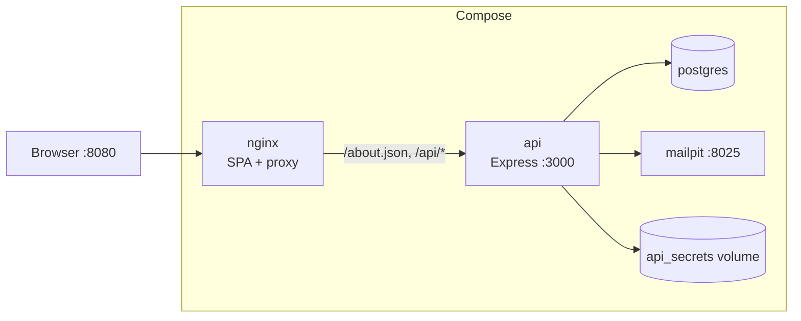
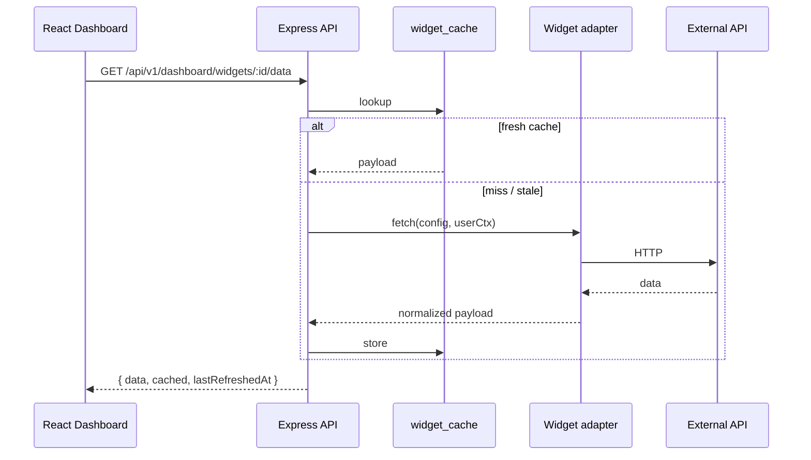
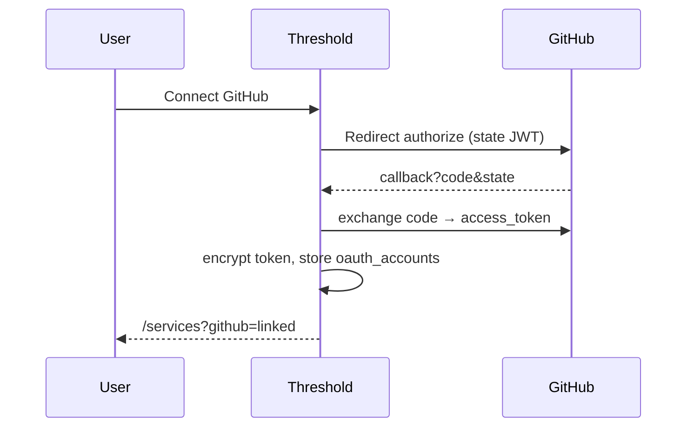

# Threshold

**Threshold** is a personalizable dashboard that brings together weather, GitHub activity, RSS feeds, finance quotes, and Hacker News into one place. Each user signs up, confirms their email, connects optional third-party accounts (GitHub OAuth), and composes a live grid of widgets that refresh on their own timers.

### What you can do

- Register with email + password (confirmation via Mailpit in local Docker)
- Build a dashboard with multiple instances of the same widget and different configs
- Reconfigure, drag-reorder, and delete widgets — all persisted server-side
- Link a GitHub account (optional) to unlock repository widgets
- Administer users (suspend / delete) from an admin account

---

## Services & widgets

| Service | Auth | Widgets | Parameters |
| --- | --- | --- | --- |
| **Weather** | None | `city_temperature` | `city` *(string)*, `unit` *(string)* |
| | | `precipitation_forecast` | `city` *(string)*, `days` *(integer)* |
| **GitHub** | OAuth 2.0 (required) | `recent_commits` | `repository` *(string)*, `limit` *(integer)* |
| | | `security_alerts` | `repository` *(string)*, `severity` *(string)* |
| **RSS** | None | `article_list` | `link` *(string)*, `number` *(integer)* |
| | | `feed_summary` | `links` *(string)*, `number` *(integer)* |
| **Finance** | None | `exchange_rate` | `base` *(string)*, `target` *(string)* |
| | | `crypto_price` | `coin` *(string)*, `currency` *(string)* |
| **Hacker News** | None | `top_stories` | `number` *(integer)* |
| | | `story_search` | `query` *(string)*, `number` *(integer)* |

Parameter types in `/about.json` are only `string` and `integer` (subject requirement).

---

## Installation

### Prerequisites

- Docker + Docker Compose v2
- (Optional) A GitHub OAuth App if you want repository widgets

### Quick start (no `.env` required)

```bash
git clone <repo-url>
cd G-WEB-500-COT-5-1-dashboard-40
docker compose build
docker compose up
```

On first boot the API will:

1. Wait for Postgres, run migrations
2. **Auto-generate** `JWT_SECRET` and `CRYPTO_KEY` into the `api_secrets` volume
3. **Create a demo admin** (`admin@threshold.local`) with a random password printed **once** in the API logs

```bash
docker compose logs api | grep -A3 'DEMO ADMIN PASSWORD'
```

Then open http://localhost:8080

### Environment variables

Copy `.env.example` to `.env` only if you need overrides. Everything has a safe default.

| Variable | Default | Notes |
| --- | --- | --- |
| `POSTGRES_USER` / `PASSWORD` / `DB` | `postgres` / `postgres` / `dashboard` | Used by Compose |
| `JWT_SECRET` | *(auto)* | Generated + persisted if empty |
| `CRYPTO_KEY` | *(auto)* | 64 hex chars; generated if empty |
| `APP_URL` | `http://localhost:8080` | Must match the URL you browse |
| `ADMIN_EMAIL` | `admin@threshold.local` | Demo admin |
| `ADMIN_PASSWORD` | *(random, logged once)* | Set to pin a known password |
| `GITHUB_CLIENT_ID` / `SECRET` | empty | OAuth disabled when omitted |
| `GITHUB_TOKEN` | empty | Optional server token for rate limits |

Invalid config produces a clear Zod error at API startup instead of a cryptic crash.

### GitHub OAuth App (optional)

1. GitHub → **Settings → Developer settings → OAuth Apps → New OAuth App**
2. **Homepage URL:** `http://localhost:8080`
3. **Authorization callback URL:**  
   `http://localhost:8080/api/v1/auth/oauth/github/callback`
4. Copy Client ID + Client Secret into `.env` as `GITHUB_CLIENT_ID` / `GITHUB_CLIENT_SECRET`
5. `docker compose up -d --force-recreate api`

Without these variables, GitHub widgets stay locked behind `SERVICE_OAUTH_REQUIRED` / `OAUTH_NOT_CONFIGURED` — the rest of the app works normally.

---

## Useful URLs

| URL | Purpose |
| --- | --- |
| http://localhost:8080 | Web app |
| http://localhost:8080/about.json | Subject endpoint (services + widgets) |
| http://localhost:8080/api/v1/… | REST API |
| http://localhost:8025 | Mailpit UI (confirmation emails) |

---

## Usage

1. Open the app → **Create account**
2. Open Mailpit → click the confirmation link
3. Log in → add widgets from the dashboard wizard
4. (Optional) **Services → Connect GitHub** to unlock commit / alert widgets
5. Log in as admin (see first-boot logs) → **Admin** to manage users

Minimum refresh rate per widget: **30 seconds** (enforced server-side).

---

## Stack

| Layer | Technology |
| --- | --- |
| Frontend | React 19, TypeScript, Vite, React Router, i18next (fr/en) |
| Backend | Node 22, Express, Zod, Drizzle ORM, JWT cookies, bcrypt |
| Data | PostgreSQL 16 |
| Mail | Mailpit (dev) |
| Edge | nginx (static SPA + `/api` + `/about.json` proxy) |
| Ops | Docker Compose |

---

## Repository structure

```
.
├── frontend/          # React SPA (built into the nginx image)
├── backend/           # Express API + Drizzle migrations
├── nginx/             # nginx.conf (about.json + /api proxy)
├── docs/              # Architecture, API, credits, …
├── bonus/             # Out-of-scope extras
├── docker-compose.yml
├── .env.example
└── README.md
```

---

## Architecture diagrams

### Containers



### Widget data path



### GitHub OAuth link



---

## Adding a widget

1. Implement an adapter in `backend/src/adapters/`
2. Register it in `backend/src/widgets/registry.ts` (params + Zod schema + `fetch`)
3. Add a `public/img/widget-<name>.jpg` image
4. Rebuild: `docker compose build api nginx && docker compose up -d`
5. Confirm it appears in `GET /about.json` and `GET /api/v1/widgets`

The frontend catalogue is loaded from the API — no hard-coded widget list required for the wizard.

---

## Documentation

| Doc | Description |
| --- | --- |
| [Architecture](docs/ARCHITECTURE.md) | System design, auth, caching |
| [API](docs/API.md) | REST endpoints overview |
| [Tech choices](docs/TECH_CHOICES.md) | *(skeleton — fill with team decisions)* |
| [Accessibility](docs/ACCESSIBILITY.md) | a11y notes |
| [Credits](docs/CREDITS.md) | Image & library credits |
| [Plan](docs/PLAN.md) | Delivery plan summary |

---

## License

Student project — Epitech module **G-WEB-500**.
