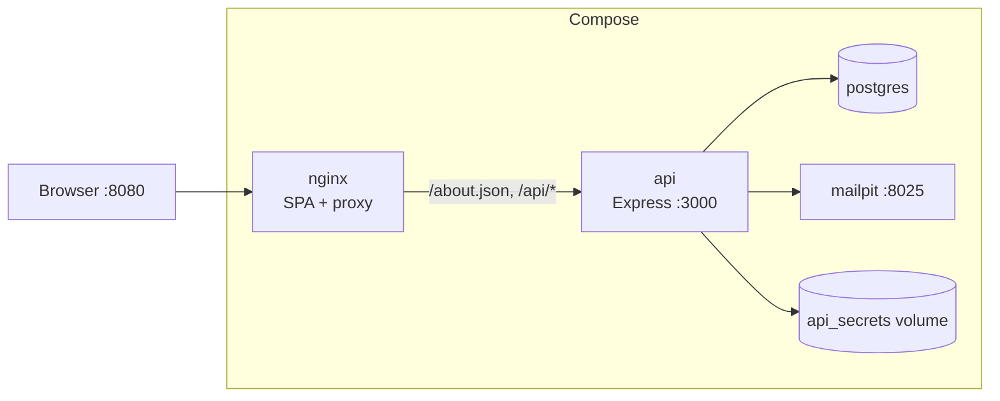
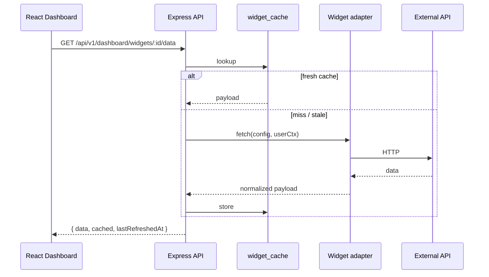
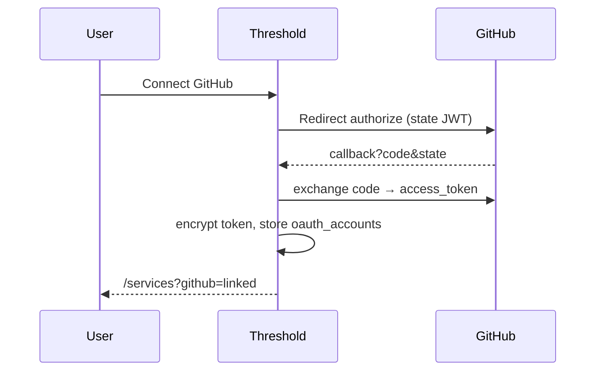

# Threshold

[English](#english) · [Français](#français)

---

<a id="english"></a>

## English

**Threshold** is a personalizable dashboard that brings together weather, GitHub activity, RSS feeds, finance quotes, and Hacker News into one place. Each user signs up, confirms their email, connects optional third-party accounts (GitHub OAuth), and composes a live grid of widgets that refresh on their own timers.

### What you can do

- Register with email + password (6-digit confirmation code by email)
- Reset a forgotten password with the same OTP flow
- Build a dashboard with multiple instances of the same widget and different configs
- Reconfigure, drag-reorder, and delete widgets — all persisted server-side
- Link a GitHub account (optional) to unlock repository widgets
- Administer users (suspend / delete) from an admin account

### Services & widgets

| Service | Auth | Widgets | Parameters |
| --- | --- | --- | --- |
| **Weather** | None | `city_temperature` | `city` *(string)*, `unit` *(string)* |
| | | `precipitation_forecast` | `city` *(string)*, `days` *(integer)* |
| **GitHub** | OAuth 2.0 (required) | `recent_commits` | `repository` *(string)*, `limit` *(integer)* |
| | | `security_alerts` | `repository` *(string)*, `severity` *(string)* |
| **RSS** | None | `article_list` | `link` *(string)*, `number` *(integer)* |
| | | `feed_summary` | `links` *(string)*, `number` *(integer)* |
| **Finance** | None | `exchange_rate` | `base` *(string)*, `target` *(string)* |
| | | `crypto_price` | `coin` *(string)*, `currency` *(string)* |
| **Hacker News** | None | `top_stories` | `number` *(integer)* |
| | | `story_search` | `query` *(string)*, `number` *(integer)* |

Parameter types in `/about.json` are only `string` and `integer` (subject requirement).

### Installation

#### Prerequisites

- Docker + Docker Compose v2
- (Optional) A GitHub OAuth App if you want repository widgets

#### Quick start (no `.env` required)

```bash
git clone <repo-url>
cd G-WEB-500-COT-5-1-dashboard-40
docker compose build
docker compose up
```

On first boot the API will:

1. Wait for Postgres, run migrations
2. **Auto-generate** `JWT_SECRET` and `CRYPTO_KEY` into the `api_secrets` volume
3. **Create a demo admin** (`admin@threshold.local`) with a random password printed **once** in the API logs

```bash
docker compose logs api | grep -A3 'DEMO ADMIN PASSWORD'
```

Then open http://localhost:8080

#### Environment variables

Copy `.env.example` to `.env` only if you need overrides. Everything has a safe default.

| Variable | Default | Notes |
| --- | --- | --- |
| `POSTGRES_USER` / `PASSWORD` / `DB` | `postgres` / `postgres` / `dashboard` | Used by Compose |
| `JWT_SECRET` | *(auto)* | Generated + persisted if empty |
| `CRYPTO_KEY` | *(auto)* | 64 hex chars; generated if empty |
| `APP_URL` | `http://localhost:8080` | Must match the URL you browse |
| `SMTP_HOST` / `PORT` | `mailpit` / `1025` | Override with `smtp.gmail.com` / `587` for Gmail |
| `SMTP_USER` / `PASS` | empty | Required for Gmail (App Password) |
| `SMTP_FROM` | `Threshold <no-reply@…>` | From address (use your Gmail when sending via Google) |
| `SMTP_SECURE` | `false` | `true` only for port 465 |
| `ADMIN_EMAIL` | `admin@threshold.local` | Demo admin |
| `ADMIN_PASSWORD` | *(random, logged once)* | Set to pin a known password |
| `GITHUB_CLIENT_ID` / `SECRET` | empty | OAuth disabled when omitted |
| `GITHUB_TOKEN` | empty | Optional server token for rate limits |

Invalid config produces a clear Zod error at API startup instead of a cryptic crash.

#### GitHub OAuth App (optional)

1. GitHub → **Settings → Developer settings → OAuth Apps → New OAuth App**
2. **Homepage URL:** `http://localhost:8080`
3. **Authorization callback URL:**  
 `http://localhost:8080/api/v1/auth/oauth/github/callback`
4. Copy Client ID + Client Secret into `.env` as `GITHUB_CLIENT_ID` / `GITHUB_CLIENT_SECRET`
5. `docker compose up -d --force-recreate api`

Without these variables, GitHub widgets stay locked behind `SERVICE_OAUTH_REQUIRED` / `OAUTH_NOT_CONFIGURED` — the rest of the app works normally.

### Useful URLs

| URL | Purpose |
| --- | --- |
| http://localhost:8080 | Web app |
| http://localhost:8080/about.json | Subject endpoint (services + widgets) |
| http://localhost:8080/api/v1/… | REST API |
| http://localhost:8025 | Mailpit UI (OTP emails when SMTP points to Mailpit) |

### Usage

1. Open the app → **Create account**
2. Check your inbox (or Mailpit at :8025) for a **6-digit code**
3. Open **Confirm** → enter email + code → log in
4. Forgot password? Use **Forgot password** → code → new password
5. (Optional) **Services → Connect GitHub** to unlock commit / alert widgets
6. Log in as admin (see first-boot logs) → **Admin** to manage users

#### Send codes to a real Gmail inbox

Create a Google [App Password](https://myaccount.google.com/apppasswords), put it in `.env`:

```env
SMTP_HOST=smtp.gmail.com
SMTP_PORT=587
SMTP_USER=you@gmail.com
SMTP_PASS=your-16-char-app-password
SMTP_FROM=Threshold <you@gmail.com>
```

Then recreate the API: `docker compose up -d --force-recreate api`.

Minimum refresh rate per widget: **30 seconds** (enforced server-side).

### Stack

| Layer | Technology |
| --- | --- |
| Frontend | React 19, TypeScript, Vite, React Router, i18next (fr/en) |
| Backend | Node 22, Express, Zod, Drizzle ORM, JWT cookies, bcrypt |
| Data | PostgreSQL 16 |
| Mail | Mailpit (dev) or Gmail SMTP |
| Edge | nginx (static SPA + `/api` + `/about.json` proxy) |
| Ops | Docker Compose |

### Repository structure

```
.
├── frontend/  # React SPA (built into the nginx image)
├── backend/  # Express API + Drizzle migrations
├── nginx/  # nginx.conf (about.json + /api proxy)
├── docs/  # Architecture, API, credits, …
├── bonus/  # Out-of-scope extras
├── docker-compose.yml
├── .env.example
└── README.md
```

### Architecture diagrams

#### Containers



#### Widget data path



#### GitHub OAuth link



### Adding a widget

1. Implement an adapter in `backend/src/adapters/`
2. Register it in `backend/src/widgets/registry.ts` (params + Zod schema + `fetch`)
3. Add a `public/img/widget-<name>.jpg` image
4. Rebuild: `docker compose build api nginx && docker compose up -d`
5. Confirm it appears in `GET /about.json` and `GET /api/v1/widgets`

The frontend catalogue is loaded from the API — no hard-coded widget list required for the wizard.

### Documentation

Styled HTML (open in the browser when the stack is running):

| URL | Description |
| --- | --- |
| [/docs/](http://localhost:8080/docs/) | Documentation hub |
| [/docs/plan.html](http://localhost:8080/docs/plan.html) | Full delivery plan & progress |
| [/docs/architecture.html](http://localhost:8080/docs/architecture.html) | System design, auth, caching |
| [/docs/api.html](http://localhost:8080/docs/api.html) | REST endpoints overview |
| [/docs/tech-choices.html](http://localhost:8080/docs/tech-choices.html) | Tech-choice skeleton |
| [/docs/accessibility.html](http://localhost:8080/docs/accessibility.html) | a11y notes |
| [/docs/credits.html](http://localhost:8080/docs/credits.html) | Image & library credits |
| [/docs/delivery-plan.html](http://localhost:8080/docs/delivery-plan.html) | Short plan summary |
| [/docs/bonus.html](http://localhost:8080/docs/bonus.html) | Out-of-scope extras |

Markdown sources (same content, for GitHub): [Architecture](docs/ARCHITECTURE.md) · [API](docs/API.md) · [Tech choices](docs/TECH_CHOICES.md) · [Accessibility](docs/ACCESSIBILITY.md) · [Credits](docs/CREDITS.md) · [Plan](docs/PLAN.md)

### License

Student project — Epitech module **G-WEB-500**.

---

<a id="français"></a>

## Français

**Threshold** est un tableau de bord personnalisable qui regroupe météo, activité GitHub, flux RSS, cours financiers et Hacker News. Chaque utilisateur s’inscrit, confirme son email, peut lier un compte tiers (OAuth GitHub) et compose une grille de widgets qui se rafraîchissent selon leurs timers.

### Ce que tu peux faire

- S’inscrire avec email + mot de passe (code de confirmation à 6 chiffres par email)
- Réinitialiser un mot de passe oublié avec le même flux OTP
- Composer un dashboard avec plusieurs instances du même widget et des configs différentes
- Reconfigurer, réordonner (drag & drop) et supprimer des widgets — tout est persisté côté serveur
- Lier un compte GitHub (optionnel) pour débloquer les widgets de dépôt
- Administrer les utilisateurs (suspendre / supprimer) depuis un compte admin

### Services & widgets

| Service | Auth | Widgets | Paramètres |
| --- | --- | --- | --- |
| **Weather** | Aucune | `city_temperature` | `city` *(string)*, `unit` *(string)* |
| | | `precipitation_forecast` | `city` *(string)*, `days` *(integer)* |
| **GitHub** | OAuth 2.0 (requis) | `recent_commits` | `repository` *(string)*, `limit` *(integer)* |
| | | `security_alerts` | `repository` *(string)*, `severity` *(string)* |
| **RSS** | Aucune | `article_list` | `link` *(string)*, `number` *(integer)* |
| | | `feed_summary` | `links` *(string)*, `number` *(integer)* |
| **Finance** | Aucune | `exchange_rate` | `base` *(string)*, `target` *(string)* |
| | | `crypto_price` | `coin` *(string)*, `currency` *(string)* |
| **Hacker News** | Aucune | `top_stories` | `number` *(integer)* |
| | | `story_search` | `query` *(string)*, `number` *(integer)* |

Les types de paramètres dans `/about.json` sont uniquement `string` et `integer` (exigence du sujet).

### Installation

#### Prérequis

- Docker + Docker Compose v2
- (Optionnel) Une OAuth App GitHub pour les widgets de dépôt

#### Démarrage rapide (sans `.env` obligatoire)

```bash
git clone <repo-url>
cd G-WEB-500-COT-5-1-dashboard-40
docker compose build
docker compose up
```

Au premier démarrage, l’API :

1. Attend Postgres, lance les migrations
2. **Génère automatiquement** `JWT_SECRET` et `CRYPTO_KEY` dans le volume `api_secrets`
3. **Crée un admin de démo** (`admin@threshold.local`) avec un mot de passe aléatoire affiché **une fois** dans les logs API

```bash
docker compose logs api | grep -A3 'DEMO ADMIN PASSWORD'
```

Puis ouvre http://localhost:8080

#### Variables d’environnement

Copie `.env.example` vers `.env` seulement si tu as besoin de surcharges. Tout a une valeur par défaut sûre.

| Variable | Défaut | Notes |
| --- | --- | --- |
| `POSTGRES_USER` / `PASSWORD` / `DB` | `postgres` / `postgres` / `dashboard` | Utilisé par Compose |
| `JWT_SECRET` | *(auto)* | Généré et persisté si vide |
| `CRYPTO_KEY` | *(auto)* | 64 caractères hex ; généré si vide |
| `APP_URL` | `http://localhost:8080` | Doit correspondre à l’URL naviguée |
| `SMTP_HOST` / `PORT` | `mailpit` / `1025` | Remplacer par `smtp.gmail.com` / `587` pour Gmail |
| `SMTP_USER` / `PASS` | vide | Requis pour Gmail (mot de passe d’application) |
| `SMTP_FROM` | `Threshold <no-reply@…>` | Expéditeur (utiliser ton Gmail avec Google) |
| `SMTP_SECURE` | `false` | `true` uniquement pour le port 465 |
| `ADMIN_EMAIL` | `admin@threshold.local` | Admin de démo |
| `ADMIN_PASSWORD` | *(aléatoire, logué une fois)* | Fixer pour un mot de passe connu |
| `GITHUB_CLIENT_ID` / `SECRET` | vide | OAuth désactivé si omis |
| `GITHUB_TOKEN` | vide | Token serveur optionnel (rate limits) |

Une config invalide produit une erreur Zod claire au démarrage de l’API.

#### OAuth App GitHub (optionnel)

1. GitHub → **Settings → Developer settings → OAuth Apps → New OAuth App**
2. **Homepage URL :** `http://localhost:8080`
3. **Authorization callback URL :**  
 `http://localhost:8080/api/v1/auth/oauth/github/callback`
4. Copier Client ID + Client Secret dans `.env` (`GITHUB_CLIENT_ID` / `GITHUB_CLIENT_SECRET`)
5. `docker compose up -d --force-recreate api`

Sans ces variables, les widgets GitHub restent bloqués (`SERVICE_OAUTH_REQUIRED` / `OAUTH_NOT_CONFIGURED`) — le reste de l’app fonctionne.

### URLs utiles

| URL | Rôle |
| --- | --- |
| http://localhost:8080 | Application web |
| http://localhost:8080/about.json | Endpoint du sujet (services + widgets) |
| http://localhost:8080/api/v1/… | API REST |
| http://localhost:8025 | UI Mailpit (emails OTP si SMTP = Mailpit) |

### Utilisation

1. Ouvre l’app → **Créer un compte**
2. Vérifie ta boîte mail (ou Mailpit :8025) pour un **code à 6 chiffres**
3. Ouvre **Confirmer** → email + code → connexion
4. Mot de passe oublié ? **Mot de passe oublié** → code → nouveau mot de passe
5. (Optionnel) **Services → Connecter GitHub** pour débloquer commits / alertes
6. Connecte-toi en admin (logs du premier boot) → **Admin** pour gérer les utilisateurs

#### Envoyer les codes vers une vraie boîte Gmail

Crée un [mot de passe d’application](https://myaccount.google.com/apppasswords) Google, mets-le dans `.env` :

```env
SMTP_HOST=smtp.gmail.com
SMTP_PORT=587
SMTP_USER=toi@gmail.com
SMTP_PASS=ton-mot-de-passe-16-caracteres
SMTP_FROM=Threshold <toi@gmail.com>
```

Puis recrée l’API : `docker compose up -d --force-recreate api`.

Taux de rafraîchissement minimum par widget : **30 secondes** (imposé côté serveur).

### Stack

| Couche | Technologie |
| --- | --- |
| Frontend | React 19, TypeScript, Vite, React Router, i18next (fr/en) |
| Backend | Node 22, Express, Zod, Drizzle ORM, cookies JWT, bcrypt |
| Données | PostgreSQL 16 |
| Mail | Mailpit (dev) ou SMTP Gmail |
| Edge | nginx (SPA statique + proxy `/api` + `/about.json`) |
| Ops | Docker Compose |

### Structure du dépôt

```
.
├── frontend/  # SPA React (intégrée dans l’image nginx)
├── backend/  # API Express + migrations Drizzle
├── nginx/  # nginx.conf (about.json + proxy /api)
├── docs/  # Architecture, API, crédits, …
├── bonus/  # Extras hors périmètre
├── docker-compose.yml
├── .env.example
└── README.md
```

### Diagrammes d’architecture

Les diagrammes Mermaid (conteneurs, chemin des données widget, liaison OAuth GitHub) sont dans la [section English](#architecture-diagrams) ci-dessus — ils sont identiques pour les deux langues.

### Ajouter un widget

1. Implémenter un adapter dans `backend/src/adapters/`
2. L’enregistrer dans `backend/src/widgets/registry.ts` (params + schéma Zod + `fetch`)
3. Ajouter une image `public/img/widget-<name>.jpg`
4. Rebuild : `docker compose build api nginx && docker compose up -d`
5. Vérifier dans `GET /about.json` et `GET /api/v1/widgets`

Le catalogue front est chargé depuis l’API — pas de liste de widgets en dur pour le wizard.

### Documentation

Docs HTML stylées (navigateur, stack démarrée) :

| URL | Description |
| --- | --- |
| [/docs/](http://localhost:8080/docs/) | Hub documentation |
| [/docs/plan.html](http://localhost:8080/docs/plan.html) | Plan de livraison & avancement |
| [/docs/architecture.html](http://localhost:8080/docs/architecture.html) | Conception système, auth, cache |
| [/docs/api.html](http://localhost:8080/docs/api.html) | Vue d’ensemble des endpoints REST |
| [/docs/tech-choices.html](http://localhost:8080/docs/tech-choices.html) | Squelette choix tech |
| [/docs/accessibility.html](http://localhost:8080/docs/accessibility.html) | Notes a11y |
| [/docs/credits.html](http://localhost:8080/docs/credits.html) | Crédits images & bibliothèques |
| [/docs/delivery-plan.html](http://localhost:8080/docs/delivery-plan.html) | Résumé court du plan |
| [/docs/bonus.html](http://localhost:8080/docs/bonus.html) | Extras hors périmètre |

Sources Markdown (même contenu, pour GitHub) : [Architecture](docs/ARCHITECTURE.md) · [API](docs/API.md) · [Choix tech](docs/TECH_CHOICES.md) · [Accessibilité](docs/ACCESSIBILITY.md) · [Crédits](docs/CREDITS.md) · [Plan](docs/PLAN.md)

### Licence

Projet étudiant — module Epitech **G-WEB-500**.
